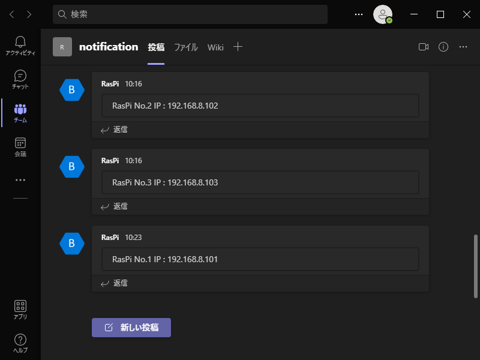
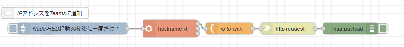

# RaspberryPi から Webhook を使用して 自身のIPアドレスを MicrosoftTeams に通知する

RaspberryPiの起動時に自身のローカルIPをTeamsに通知する。  
固定IPの設定をせずとも割当IPがわかるのでSSH接続などが楽。

今回もNode-REDから作成。  
中身は簡単なので、シェルスクリプトでcurlとか使って作ってやれば、あとはcrontab等で自動起動することでNode-REDに依存しなくて良くなる。  
が、すでに自分の環境ではRaspberryPiの起動時にNode-REDが動くのでそこに追加した。

Teams画面

今回作成したNode-REDのフロー

# Usage

Node-REDの起動、任意のブラウザで http://<Piのアドレス>:1880 にアクセス  
右上のハンバーガーメニューから

"rasPi_teams_notification.json"

を読み込んで
「http request」ノードのURLのみ変更の必要有。  
自分のteamsの任意のチャンネルに設定をしてください。

teamsでのwebhookの設定は各自調べてもらって…。  
「microsoft teams webhook」とかで調べると情報いっぱい出てきます。